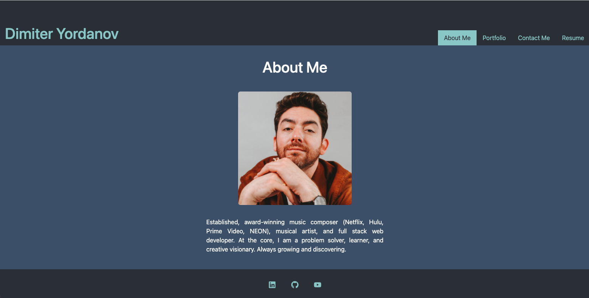
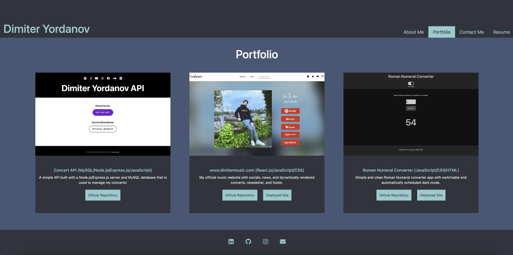
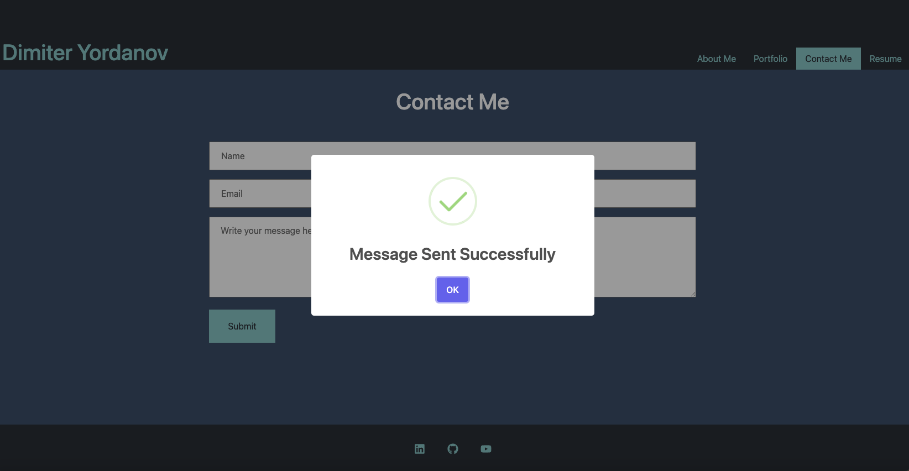
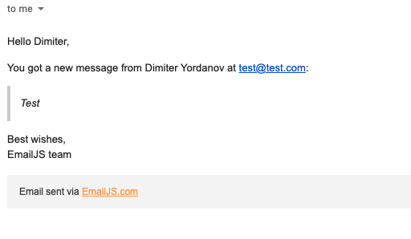
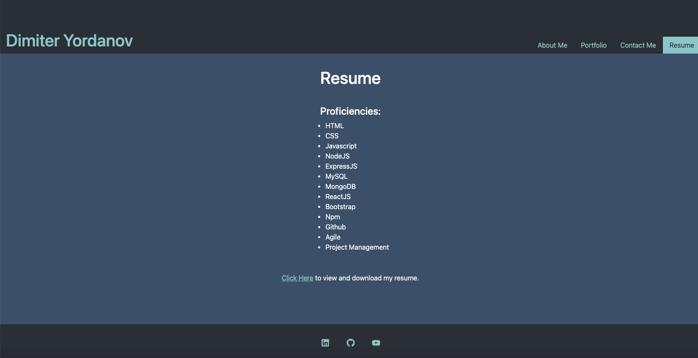

# Dimiter Yordanov's React Portfolio 

## Description
My personal portfolio including a brief bio, portfolio, contact form, and resume, all built using React.js.

## Table of Contents
  - [Description](#description)
  - [Table of Contents](#table-of-contents)
  - [Installation](#installation)
  - [Usage](#usage)
  - [Contributing](#contributing)
  - [License](#license)
  - [Links](#links)
  - [Questions](#questions)

## Installation
Visit the deployed site [here!](https://portfolio.dimitermusic.com)

## Usage
Home page set to an "About Me" section including my latest photo and a brief bio.  
  
Portfolio page with titled images of six of my dev projects, including links to the github repository and deployed site for each.  
  
Contact page using EmailJS to send form input to my email.  
  
The email from EmailJS.  
  
Resume page with a list of my dev proficiencies and a link to view and download my resume.  
  

## Contributing
Feedback is always welcome!

## License
This application is covered under the MIT License

## Links

[Deployed Site](https://dimiter-portfolio.netlify.app/)  
[Repository](https://github.com/dimitermusic/react-portfolio)

## Questions
If you have any questions, please visit my Github profile or email me using the links below

[Github](https://github.com/dimitermusic)  
[Email](mailto:dimitermusic@gmail.com)  